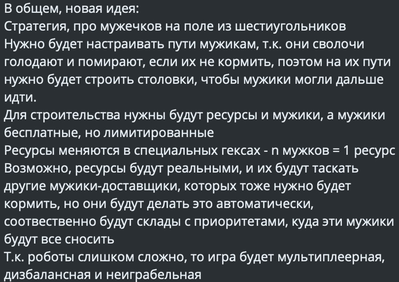

# **_Здравствуйте_**
### Оглавление
 + [Предисловие](#Start);
 + [О проекте + 2 страницы бесплатного предисловия](#What?);
 + [ТЗ](#TZ);
 + [Результаты](#results).  
 

Для мира настали тяжелые времена. Все мы хотели резвится и наслаждаться теплыми солнечными лучиками.
Жадно вдыхая кислород полной грудью.  
Однако ближайшие часы вы проведете в попытках разобраться в данном проекте, эта участь постигла
всех нас.

### О проекте
Эта история стара как мир, человеку всегда нужно было пристроить своих детей, чтобы они не мешались
под ногами. Количество способов избавиться от непосед расло по экспоненте: помочь деду в поле,
посмотреть на казнь, но лишь после третьего поколения, человечество обрело способ актуальный
и по сей день - отправить сына к бабке, что может быть проще?  
Однако чем заняться у бабушки в деревне, у которой есть лишь старый компьютер, приватизированный
дедом после гражданской службы.  
Итак мы представляем вам продукт коротко названный TVOY GIMN (Total Version IsqK's Game In
Mirror Network), который утолит ваше желание показать деревенским мальчишкам, что такое технологии
  
##### ТЗ
Данный проект был разработан по индивидуальному заказу, перед нами стояла уникальная задача, а
справились ли мы с ней решите вы

Также по уникальному бонусу от нашей компании данный заказчик получил сайт-блог с рейтингом для его
игры, а также Discord-бота, чтобы по кайфу было

##### Что же получилось?
Спросите вы, а мы промолчим и представим вам несколько отдельных, но дополняющий и охватывающий
все области обитания молодежи, частей:
+ [Клиент](../Client/readme.md)
+ [Сервер](../Server/readme.md)
+ [Бот](../Discord_bot/readme.md)  

Общий объем: строки 