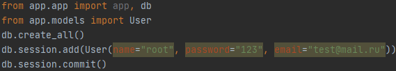
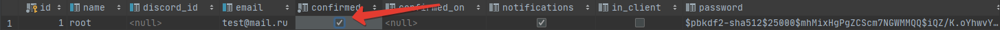

# _Хей, вы уже здесь_
+ [Предисловие](#Start);
+ [ТЗ](#TZ);
+ [Результаты](#results);
+ [Объяснение решений](#about);
+ [Как запускать сее творение](#launch).  
   

Вот оно творение тысяч умов, сердце проекта, а именно - сервер. Однако заблудится получится лишь в
 части работы самого сервера, т.к. остальные моменты просты и банальны до неузнаваемости
 
 ### ТЗ
 Нам требовался очевидный функционал сервера: регистрация, авторизация, создание сессий,
 подключение к ним других пользователей, старт сессиии и ее модерация на сервере.
 Также было решено добавить сайт с блогом для новостей об игре, а также рейтингом пользователей
 
 ### Результаты
 В итоге был реализован весь выше перечисленный функционал, а также добавлен функционал друзей.  
 Как-то пустовато, согласитесь, но что поделаешь.
 
 ### Объяснение решений
 ##### Немного о задумке
 Lockstep уже устарел и пора последовать примеру StarCraft2, а не великому WarCraft3,
 и реализовать сервер для RTS.  
 Изначально планировалось создать сервер на сокетах, это бы упростило многие задачи:
 + можно было бы отследить выход оппонента
 + высчитывать пинг
 + уменьшить задержки
 + контролировать инъекции
 + все плюсы и не перечислишь
 ##### Немного о решении
 Однако хотелось получить рабочую версию проекта и без вложений,
 а т.к. для доступа по ip хероку требуется SSL сертификат(однако возможно возникло недопонимание),
 было решено реализовать функционал на HTTP сервере, переборов все его проблемы и
 охватить побольше тем. 
 ##### Проблемы с Heroku 
 Ура, казалось бы мы можем запустить наш чудо сервер на Heroku, однако реализованная система
 модераций сессий, запускающая отдельный поток для каждой игры, не может работать на Heroku, т.к.
 код запускается совсем не в тех потоках, в каких планировалась и извлечь ID из названия
 потока не удается.
 ##### Где библиотеки для API?
 Как показали уроки, эти библиотеки не очень функциональны, они не дают взлететь и расправить
 крылья. Поэтому все реализовывалось своими ручками и в нужных нам количествах.
 ##### Библиотека OpenSimplex
 Как оказалось дыры есть везде. Так была обнаруженна ошибка в библиотеке, именно поэтому вы можете
 наблюдать файл [copensimplex.py](./app/api/copensimplex.py), где была исправленна ошибка в
 результате, которой мы получали разные шумы на разных операционных системах.  
 На данный момент разработчик уведомлен об ошибке, и она исправлена, однако мы взяли самое
 необходимое, естественно указав на авторство.
 ##### A*
 Скажем честно, поиск путей глубокая и интересная тема, но в рамках данного проекта, мы
 позаимствовали ее с интернет ресурса, обнаружив и там несколько изъянов, которые устранили, так же
 указав на авторство. 
 ##### Импорты
 Циклические импорты - это головная боль. Господи, хоть кто-нибудь дал бы объяснение,
 как с ними бороться. 1 функцию пришлось скопировать, чтобы избавится от головной боли, простите
 
 ### КАК запускать сее творение
 Перейдя в часть Discord-bot вы обнаружите гайд по созданию бота, и если не измените параметры в
 settings.json, то легко сможете соединить два данных инструмента, создав вебхуки. 
 ([Извлечение токена](https://github.com/Akizo96/de.isekaidev.discord.wbbBridge/wiki/How-to-get-Webhook-ID-&-Token#:~:text=At%20Discord%20you%20can%20create,that%20you%20need%20to%20copy))  
 Видео лучше раскрывающего, как настроить работу Oauth2 дискорда не существует: [ссылка](https://www.youtube.com/watch?v=8PygF2T79i4)  
 Все эти поля нужно будет указать в файле [config.py](./app/config.py). Придется также поделится почтой.
 Помните, что вы можете запустить данный сервер на хероку, но из-за проблем описанных выше,
  вам лучше воспользоваться утилитой ngrok, указав полученный адрес.  
 Мы не создаем изначально пользователя с админскими правами, т.к. у нас есть руки и есть база
 данных, но если он вам понадобиться, то создайте пользователя  
   
 не забудьте отметить галочкой, что он авторизован  
 
 Затем укажите связь в таблице role_user между пользователем и единственной ролью на сервере   
 Также и для этой части вам потребуется Shapely, а для него и GEOS соотвественно, так что если вы
 его еще не установили то [ссылка](../Client/readme.md)  
 Также, если вы захотите сыграть в n кол-во человек, вместо 2, то просто поменяйте максимум
 участников в [constants.py](./app/constants.py), т.к. большее кол-во игроков на одном компьютере
 не протестировать  
 Объем кода: 3575 -~50-100 строк за небольшой копипаст, признаем этот грех сразу
 
